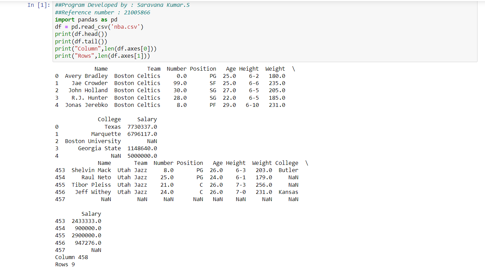

# Read-from-CSV

## AIM:
To write a python program for reading the csv file content.

## EQUIPEMENT'S REQUIRED:
PC Anaconda - Python 3.7

## ALGORITHM:
### Step 1:
Load the CSV into a DataFrame.
### Step 2:
Print the number of contents to be displayed using df.head().
### Step 3:
 The number of rows returned is defined in Pandas option settings.
### Step 4:
Check your system's maximum column with the pd.options.display.max_column statement.
### Step 5:
 Increase the maximum number of rows to display the entire DataFrame.

## PROGRAM:
```
##Program Developed by : Saravana Kumar.S
##Reference number : 21005866
import pandas as pd
df = pd.read_csv('nba.csv')
print(df.head())
print(df.tail())
print("Column",len(df.axes[0]))
print("Rows",len(df.axes[1]))
```
## OUTPUT:


## RESULT:
Thus the program is written to read the csv file.